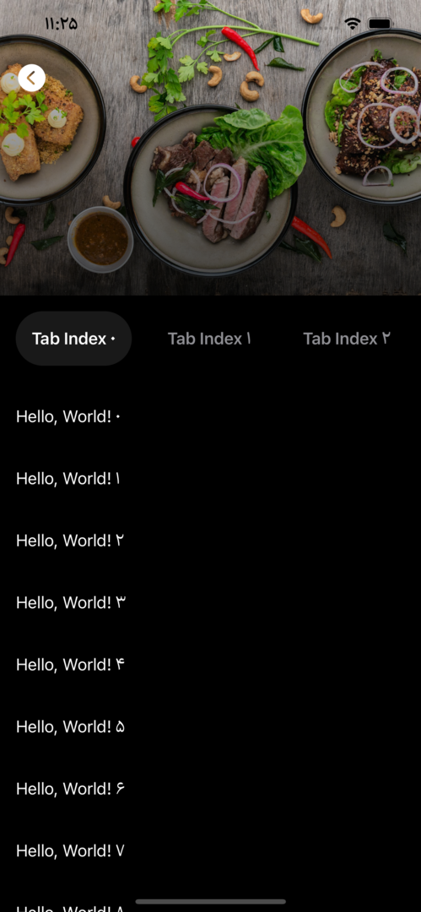
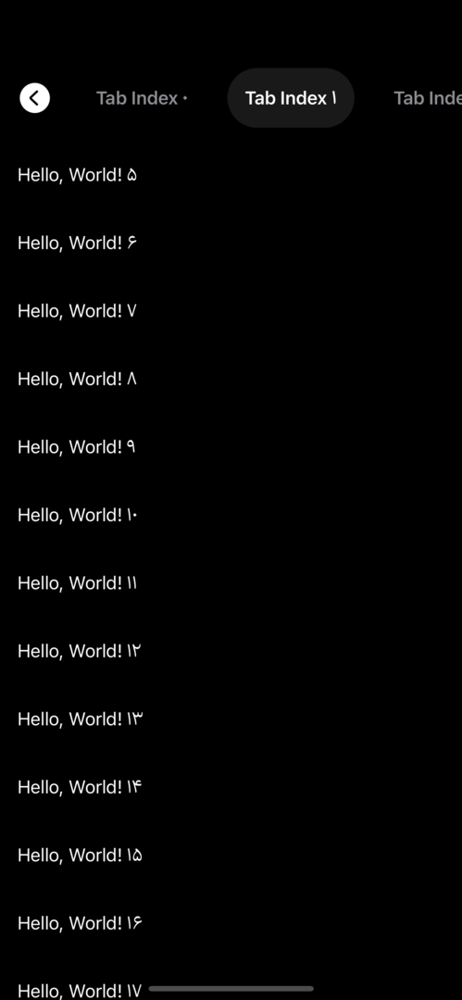

# SwiftUI Sticky Header Experiment

In this project I tried to experiment with some features such as pinned views in section, `.coordinateSpace(name:)` view modifier, `.matchedGeometryEffect(id:in:)` view modifier.

This project is mostly inspired by [a video by Kavsoft on YouTube](https://www.youtube.com/watch?v=ATi5EnY5IYE) with some changes and additions.

## Testing the result

Just open **StickyHeader.xcodeproj** and change the bundle identifier and set the development team if necessary.

To see the final result, use a simulator or a real device since SwiftUI Previews' behavior is sometimes unexpected.

Build, run and enjoy.

## Preview

Expaneded Header             |  Sticky Tab Bar
:---------------------------:|:---------------------------:
 |

## Consider before using in your app

- This project is not an example of how to prepare your design for dark mode.
- Not all views and other design elements are designed based on [Apple's Human Interface Guideline](https://developer.apple.com/design/human-interface-guidelines/guidelines/overview).

## Notices

- The image used for testing purposes is [a Photo](https://unsplash.com/photos/-YHSwy6uqvk?utm_source=unsplash&utm_medium=referral&utm_content=creditShareLink) by [Lily Banse](https://unsplash.com/@lvnatikk?utm_source=unsplash&utm_medium=referral&utm_content=creditCopyText) on [Unsplash](https://unsplash.com/s/photos/food?utm_source=unsplash&utm_medium=referral&utm_content=creditCopyText) 

